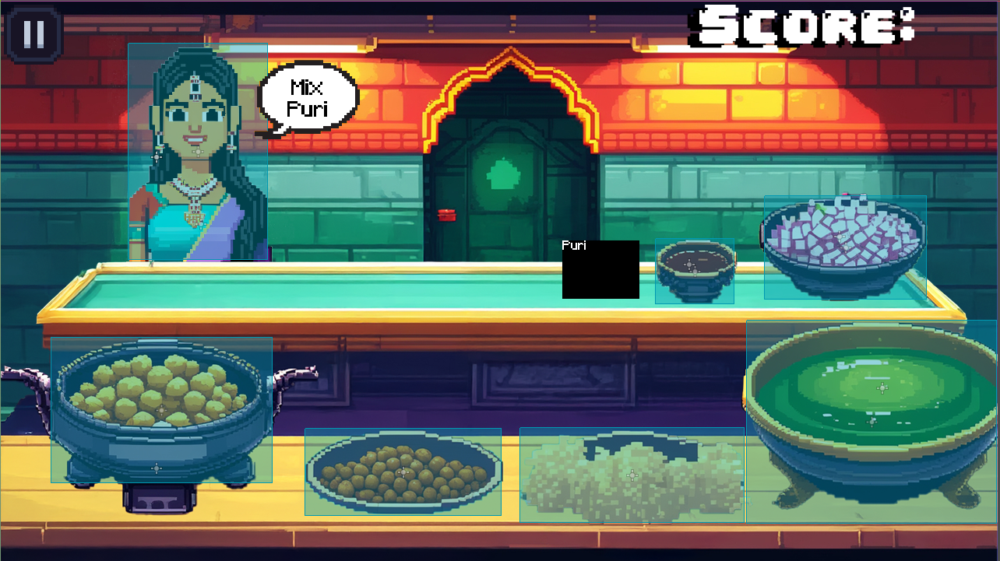
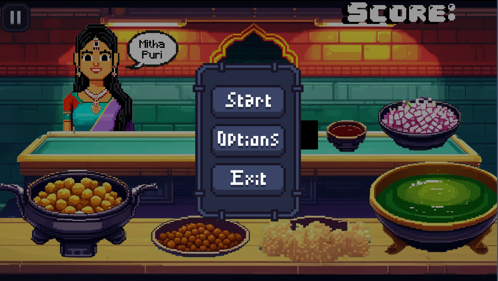

# Pani Puri Simulator 🍽️🎮

## 📝 About the Project
Pani Puri Simulator is a **fast-paced casual cooking game** inspired by Indian street food culture. It blends elements of **time management, customer orders, and strategy**, bringing the vibrant experience of a chaat bhandar to life in a pixel-art style!

## 🎮 Gameplay Features
- **Randomized Customer Orders** – Every customer has a unique preference, from *Mitha Puri* to *Teekha Puri*.
- **Interactive Cooking** – Click on ingredients to assemble the perfect Pani Puri.
- **Score Tracking & Feedback** – Earn points for correct orders, and see visual feedback for mistakes.
- **Simple & Intuitive UI** – Start, Restart, and Exit options for a smooth experience.

## 📸 Screenshots



## 🎮 How to Play
1. Click on ingredients to prepare the **correct** Pani Puri.
2. Serve customers by matching their **exact** order.
3. Earn points for correct orders, and get **visual feedback** for mistakes.
4. Keep up with the **increasing pace** as more customers arrive!

## 🚀 Getting Started
### Prerequisites
- [Godot Engine 4.4](https://godotengine.org/download)

### Installation
1. Clone the repository:
   ```sh
   git clone https://github.com/yourusername/PaniPuriSimulator.git
   ```
2. Open the project in Godot.
3. Run the game and start serving delicious Pani Puris! 🍽️

## 🛠️ Development Progress
✅ Ingredient Click & Response  
✅ Customer Order Randomization  
✅ Basic UI & Menu  
✅ Score Tracking & Feedback  
🔲 Advanced AI & Order Complexity  
🔲 More Levels & Mechanics  

## 🤝 Contributing
Interested in helping? Feel free to open an issue or submit a pull request!

## 📬 Contact
- **Creator:** [Rahul Challapalli](https://github.com/yourusername)
- **Email:** rchallapalli32@gmail.com

⭐ **If you like this project, don’t forget to star the repo!** ⭐
